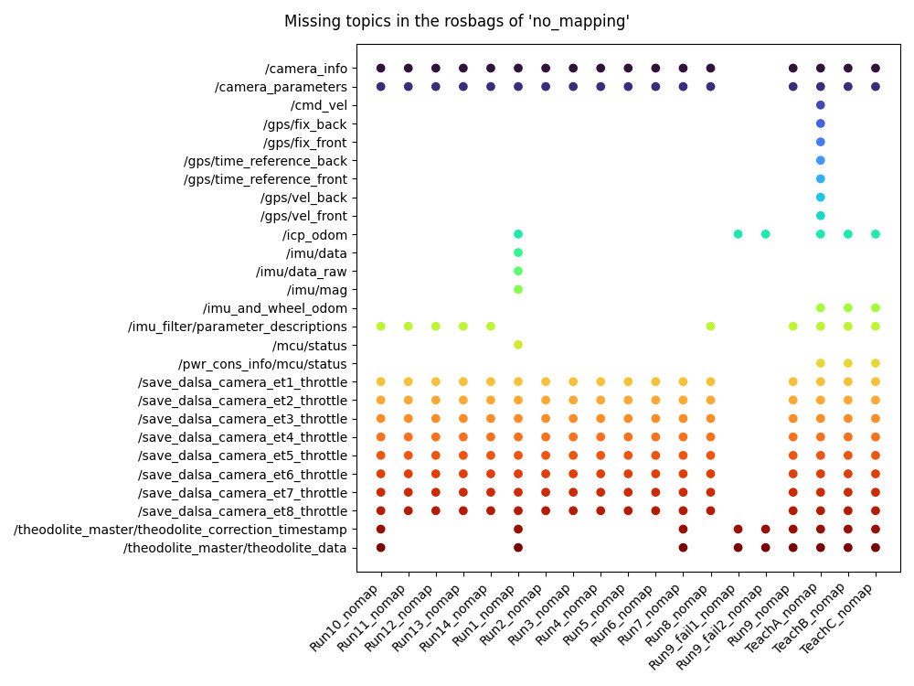

# `topic-compare`

> check topic consistency between rosbags in a directory

## Use case

Say you have a bunch of rosbags gathered inside a folder and you don't know whether or not all those rosbags contain the same data with the same topics. `rosbag-tools topic-compare` will :

* retrieve a list of the topics contained in each rosbag
* export a summary of the topics in a JSON or YAML file
* output a figure that gives out which topics are missing in each rosbag

Here is the result of using `rosbag-tools topic-compare` on the [Montmorency Forest Wintertime Dataset](https://github.com/norlab-ulaval/Norlab_wiki/wiki/Montmorency-Forest-Wintertime-Dataset)



## Usage

`topic-compare` can be used both as a command line application and in Python code.

### Command line

A basic use of `topic-compare` is to simply call it with the path of the folder that contains rosbags. This will simply print out a YAML string with a summary of the comparison.

```console
rosbag-tools topic-compare /path/to/folder/with/rosbags
```

You can also generate a figure that will show what topics are missing in each rosbag with the `--plot/-p` flag. This figure helps when you want to find out if all rosbags in a dataset contains all or some of the expected topics.

```console
rosbag-tools topic-compare -p /path/to/your/rosbag/dataset
```

Here are all the CLI options of `topic-compare`:

```console
$ rosbag-tools topic-compare -h
Usage: rosbag-tools topic-compare [OPTIONS] BAGFOLDER

  Compare rosbag files that are stored in BAGFOLDER

  BAGFOLDER is the path to a dataset directory

Options:
  -m, --metadata PATH             Metadata summary output path
  -p, --plot                      Plotting mode : display a summary plot
  --fig, --summary-figure-path TEXT
                                  Topic consistency figure export path
  -h, --help                      Show this message and exit.

```

### Python Code API

You can also call `rosbag-tools topic-compare` directly into your Python code :

```py
from rosbag_tools.topic_compare import BagTopicComparator

data_path = "/path/to/folder/with/rosbags"
topic_comparator = BagTopicComparator(data_path)

# This step may take time as it open each rosbag separately
# Will show a progress bar
topic_comparator.extract_data()

# Export summary to a JSON file
topic_comparator.export_metadata()  # Defaults to topics_<foldername>.json
topic_comparator.export_metadata("topics.json")
topic_comparator.export_metadata("topics.yaml")

# Generate a figure with the name of the
# missing topics for each rosbag
topic_comparator.plot()                               # Show figure
topic_comparator.plot(img_path="topics_summary.jpg")  # Save figure to path

# Create a new comparator from exported metadata
topic_comparator = BagTopicComparator.from_json("topics.json")
topic_comparator = BagTopicComparator.from_yaml("topics.yaml")
```
